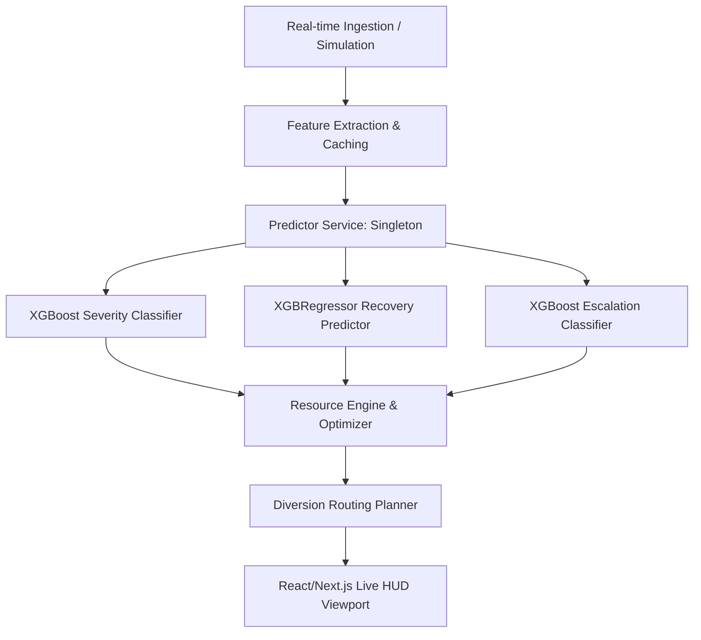

# 🚦 TrafficOps AI

<p align="center">
 
  
  
  
  
</p>

<p align="center">
  <h3><strong>City-Scale Traffic Intelligence & Machine Learning Response Orchestration</strong></h3>
  <p align="center">
    An AI-powered, Event-Driven Traffic Command Center designed to dynamically simulate, predict, and optimize emergency corridors, road closures, and traffic diversions in smart cities.
  </p>
</p>

<p align="center">
  <a href="https://traffic-ops-ai-seven.vercel.app/"><strong>🚀 Live Demo</strong></a> |  
  <a href="https://github.com/devsarthak2005/TrafficOps-AI"><strong>⭐ GitHub Repo</strong></a>
</p>

---

## 💡 The Elevator Pitch

In a rapidly urbanizing world, manual traffic management cannot scale. Emergency vehicle delays, unplanned road works, and sudden public gatherings lead to chaotic congestion cascades, causing billions of dollars in economic waste and costing lives.

**TrafficOps AI** is a next-generation smart city command center that bridges **traffic simulation** and **predictive machine learning**. By utilizing a trained ensemble of **XGBoost classifiers and regressors**, it instantly predicts incident severity, recovery duration, and escalation risk, recommending optimized resource deployments (officers, barricades, vehicles) and computing smart diversion routes in under **100 milliseconds**.

---

## 🎯 The Problem

1. **Reactive, Not Proactive**: Command centers only respond *after* traffic gridlocks occur.
2. **Poor Incident Forecasting**: Predicting how long an incident will block traffic or whether it will escalate to neighboring junctions is currently a manual guessing game.
3. **Sub-optimal Resource Allocation**: Dispatching emergency crews and barricades lacks dataset-driven sizing, leading to local bottlenecks or wasteful deployments.
4. **Lack of Dynamic Routing**: Diversions are static and fail to adapt to crowd spillover.

---

## 🚀 The Solution

**TrafficOps AI** turns command centers from reactive observers into proactive orchestrators.



### How We Solve It:
* **ML-driven Predictions**: Uses chronological training datasets to accurately evaluate severity, clearance time, and cascading risks.
* **Proactive Resource Optimization**: Calculates dynamic resource scores using proximity to hospitals, junction criticality, and escalation probability.
* **Automatic Diversions**: Renders Leaflet-driven visual bypass routes based on predicted impact level and crowd density.
* **Executive Briefings**: Integrates LLMs (with rule-based fallbacks) to compile real-time briefings for city commissioners and citizen advisories.

---

## ✨ Key Features

* **⚡ Real-Time Scenario Simulator**: Inject rallies, VIP movements, sports events, crashes, and weather incidents on a live map viewport.
* **🤖 Multi-Model ML Pipeline**: 
  * **Severity Predictor**: Classifies incidents into Low, Medium, High, or Critical.
  * **Recovery Regressor**: Predicts clearance times in minutes.
  * **Escalation Classifier**: Computes the likelihood of incident propagation.
* **🧠 Resource Allocation Optimizer**: Recommends staffing levels and budgets dynamically.
* **🗺️ Interactive Control Room HUD**: A dark, glassmorphic control dashboard rendering live network status and Leaflet mapping previews.
* **🔄 Hot-Reloading Model Retraining**: Retrain the model on user feedback and instantly hot-swap the weights in memory without downtime.

---

## 🛠️ Tech Stack

| Component | Technology | Description |
| :--- | :--- | :--- |
| **Frontend** | React, Next.js 15, TypeScript | Responsive, glassmorphic executive HUD |
| **State Store** | Zustand | Fast, memoized global state selector updates |
| **Mapping** | Leaflet, OpenStreetMap | Interactive, high-precision geospatial visualization |
| **Backend** | FastAPI (Python) | High-performance asynchronous API endpoints |
| **Database** | SQLite | Clean relational storage of active incidents |
| **ML Engine** | scikit-learn, XGBoost | Chronological classifiers and regressor models |

---

## 🏃 Run Locally

### Prerequisites
* Node.js (v18+)
* Python (v3.10+)

### Setup Backend
1. Navigate to the backend directory:
   ```bash
   cd backend
   ```
2. Create and activate a virtual environment:
   ```bash
   python -m venv .venv
   .venv\Scripts\activate   # Windows
   source .venv/bin/activate # macOS/Linux
   ```
3. Install dependencies:
   ```bash
   pip install -r requirements.txt
   ```
4. Set up environment variables in `.env`:
   ```env
   GEMINI_API_KEY=your_optional_gemini_key_here
   OSRM_BASE_URL=https:<YOUR_OSRM_ENDPOINT>
   ```
5. Launch the FastAPI server:
   ```bash
   uvicorn app.main:app --reload --port 8000
   ```

### Setup Frontend
1. Navigate to the frontend directory:
   ```bash
   cd ../frontend
   ```
2. Install npm packages:
   ```bash
   npm install
   ```
3. Set up environment variables in `.env.local`:
   ```env
   NEXT_PUBLIC_API_BASE_URL=http://localhost:8000
   ```
4. Run the Next.js development server:
   ```bash
   npm run dev
   ```
5. Open [http://localhost:3000](http://localhost:3000) in your browser.

---

## 🗺️ Future Roadmap

1. **Graph Convolutional Networks (GCN)**: Modeling the traffic network as a spatial graph to forecast structural gridlock propagation.
2. **Computer Vision Ingestion**: Running YOLOv8 on CCTV streams to count vehicle queues and feed traffic density metrics directly into the ML engine.
3. **Signal green-wave Overrides**: Interface with SCATS/SCOOT signal controllers to automate route-clearing signal phases.

---

## 📄 License
This project is licensed under the MIT License - see the LICENSE file for details.

---
<p align="center">
  Built with ❤️ by Team - <strong> Ah Jin Guild </strong> during the FLIPKART GRIDLOCK HACKATHON 2.0  ·  ROUND 2
</p>
